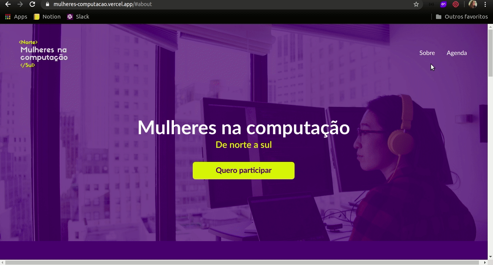

<br />
<p align="center">
    <h1 align="center">Mulheres na computação</h1>

  <p align="center">    
     De norte a sul. 
       <br />
    <br />
  </p> 

## :checkered_flag: Índice

* [Sobre](#bulb-sobre)
* [Demo](#iphone-demo)
  * [Live](#live)  
* [Tecnologias](#computer-tecnologias)
* [Como utilizar](#wrench-como-utilizar)
* [Contatos](#mailbox_with_no_mail-contatos)

## :bulb: Sobre
Landing page criada para o evento "Mulheres na computação: de norte a sul", realizado pelo projeto que participo chamado Meninas na computação - UNIFAP, em conjunto com o projeto Gurias da computação - UNIPAMPA. 

## :iphone: Demo

### Live

A aplicação poderá ser acessada pelo link: https://mulheres-computacao.vercel.app

<p align="center">
    
 </p>


### :computer: Tecnologias:
- ReactJS
- CSS

### :wrench: Como Utilizar

1. Fork ou clone esse repositório:
```sh 
git@github.com:Lorenalgm/mulheres_norte_sul.git
```
2. Abra o projeto no seu editor de texto
3. Inicie o server!
```sh 
    yarn start
```

## :mailbox_with_no_mail: Contatos
Linkedin: https://www.linkedin.com/in/lorenagmontes/

   
